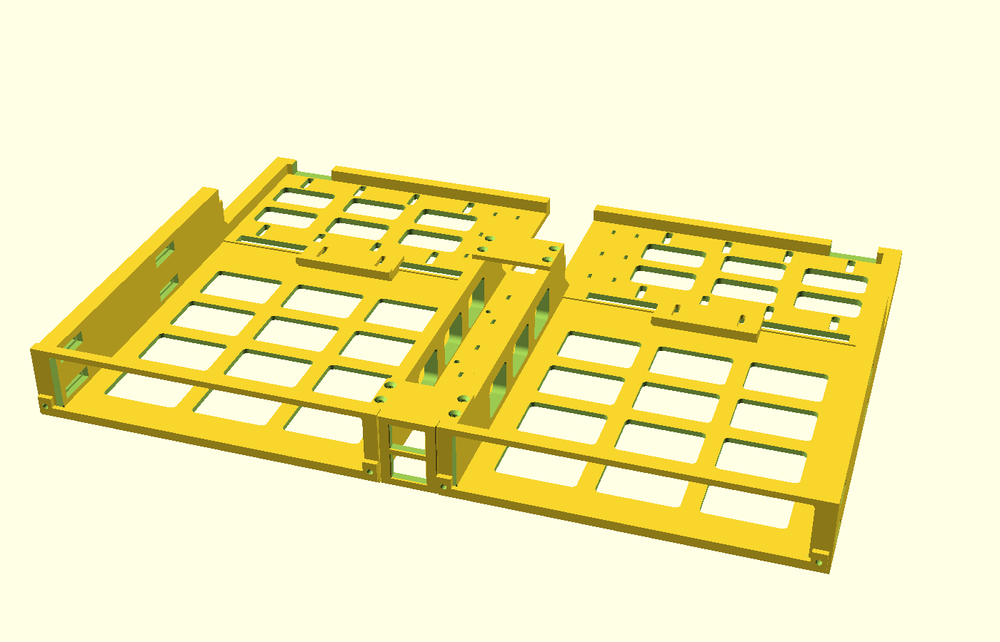

# Micro-PC rack system

3D-printable 19" rack mounting for 1-litre micro PCs. The current design is a 1U
shelf holding two machines side by side, front-loading, with keystone jacks for
console video at the front and a bolt-on bay for the power bricks at the rear.



**Status:** v3 designed and verified in CAD. Nothing printed yet.

## What it has to do

The requirements the design has to meet. [docs/DECISIONS.md](docs/DECISIONS.md)
explains how each one shaped it.

1. Two 1L micro PCs in 1U of a 19" rack, lying flat, fronts facing out.
2. Mixed models: currently one Lenovo Tiny (179 × 183 × 34.5 mm) and one Dell
   OptiPlex 7060 Micro (182 × 178 × 36 mm).
3. Front keystone jacks for DP/HDMI pass-through — console access without reaching
   behind the rack. Video only; networking comes in from the rear (usually SFP).
4. Each machine removable from the front without disturbing the other.
5. A rear stop to locate each machine.
6. Power bricks and cord management on the shelf itself.
7. Metal, not plastic, in the rack-mounting load path.
8. Front-rail mounting only — no dependence on rear rails. That covers 2-post and
   wall-mount racks, and 4-post racks where the rear is taken up by cabling.
9. Modular toward a future 2U shelf for Minisforum MS-01s, sharing parts.

## Layout

```
cad/rack_1u_micro.scad   parametric OpenSCAD source — the single source of truth
stl/                     binary STLs, pre-oriented for printing; regenerate with build.sh
build.sh                 renders every part from the source
tests/run.sh             interference, clearance and alignment checks
tools/canon_stl.py       makes STL output stable, so git diffs mean real changes
docs/BUILD.md            print settings, bill of materials, assembly
docs/DECISIONS.md        why the design is the way it is
docs/prior-art.md        survey of public designs and what was learned from them
```

## Working on it

```
bash build.sh                                    # all parts
openscad -o stl/tray_left.stl -D 'part="tray_left"' cad/rack_1u_micro.scad
```

Change dimensions in the source, not in the STLs. `build.sh` writes STLs in a canonical
triangle order, so rebuilding unchanged geometry leaves git clean — an STL diff means
the shape really changed. A different OpenSCAD version can still tessellate curves
differently, so if STLs change after upgrading OpenSCAD, that's why. v1 to v3.1 were iterated in Claude Cowork before this repo had any git
history, so the first commit is v3.1 (tagged `v3.1`) and the earlier versions survive
only in [docs/DECISIONS.md](docs/DECISIONS.md). Development continues here with Claude
Code; later delivered designs get their own tags. **Run
`bash tests/run.sh` after changing any parameter** — it checks every part pair on
both sides for collisions, that each machine still slides out, and that screw holes
still line up.

Questions and test-fit results are best as GitHub issues, one per topic, with photos
where relevant.

## Open items

- [ ] Caliper-check the steel bracket's 23.8 mm hole-row spacing before printing both
      trays. If it differs, change `brk_row_dz`.
- [ ] Print one tray first and test-fit both machines.
- [ ] Watch temperatures for the first few weeks — see the thermal note in
      DECISIONS.md.
- [ ] Choose a keystone coupler type (DP or HDMI) per machine.
- [ ] Get the MS-01 power adapter dimensions, then design the 2U shelf.

## Licence

© 2026 Matt Miller and contributors. Everything in this repo — CAD source, STLs,
scripts and docs — is licensed under
[CC BY-NC-SA 4.0](https://creativecommons.org/licenses/by-nc-sa/4.0/); full text in
[LICENSE](LICENSE). In short: print it, use it and remix it freely, as long as you
credit this project, don't use it commercially (that includes selling prints), and
share your remixes under the same licence. For anything commercial, open an issue
and ask.
